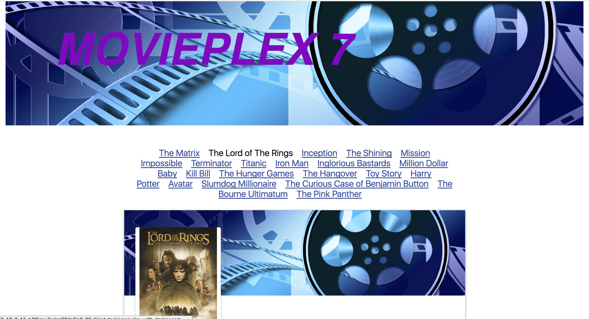
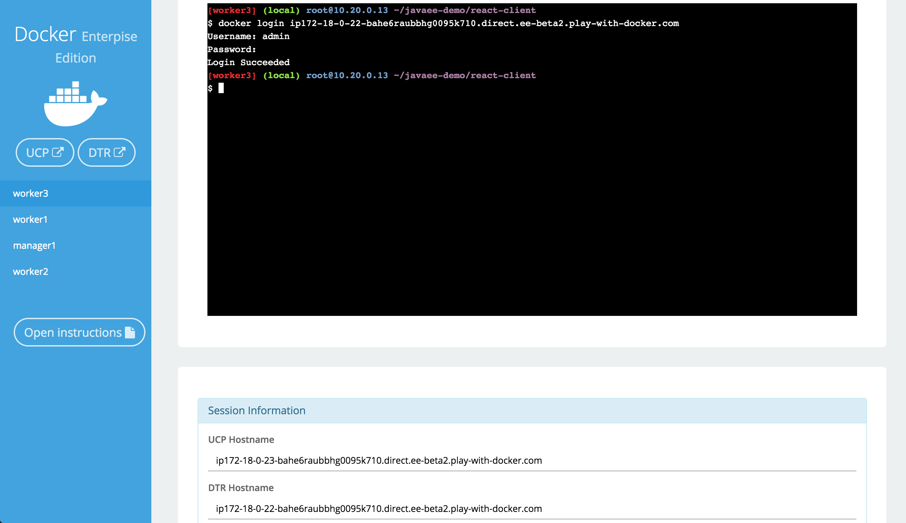
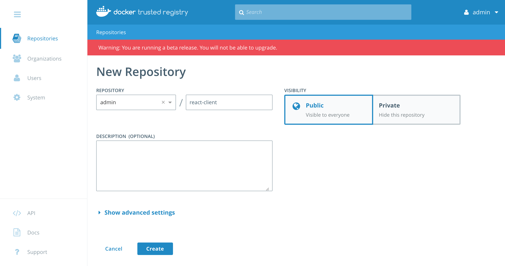
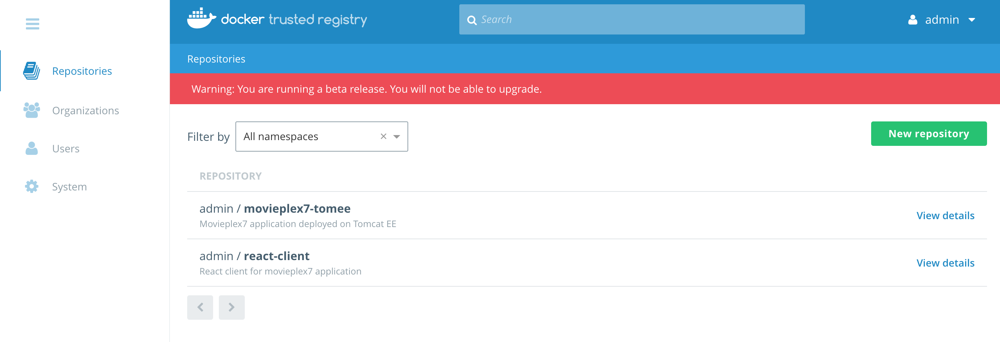
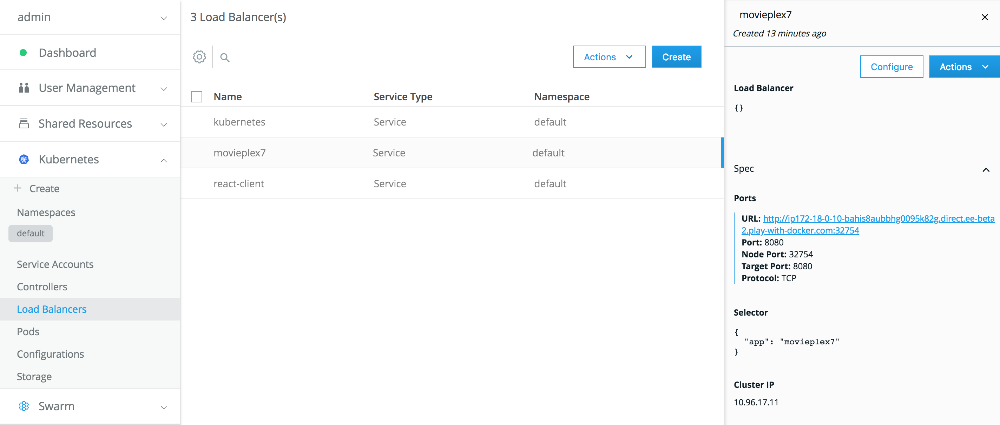
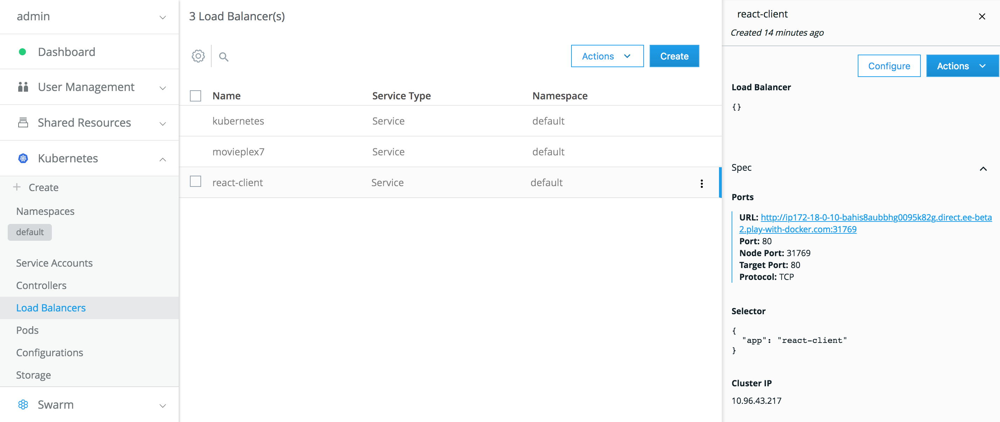

# Modernizing Traditional Java Applications

In this Hands-on Lab, we will show you how to take a traditional Java EE app, and compile it to run in a lightweight Java container. The app we’ve chosen is an old Java EE demo called Movie Plex 7 that was originally written to run in Wildfly 3. You can find our fork of the repo in our javaee-demo repository on GitHub. In fact, if you were to take that repository, and lift the movieplex7-1.0-SNAPSHOT file, you could run that in a Java Application Server, such as WebLogic, Wildfly, or WebSphere.

# Table of Contents

* [Task 0: The Play with Docker Lab Environment](#Step-0-The-Play-with-Docker-Lab-Environment)
* [Task 1: Building the App in a Container](#Step-1-Building-the-App-in-a-Container)
* [Task 2: Adding a New Front-end](#Step-2-Adding-a-New-Front-End)
* [Task 3: Moving from Wildfly to Tomcat EE](#Step-3-Moving-from-Wildfly-to-Tomcat-EE)
* [Task 4: Push to Docker Trusted Registry](#Step-4-Push-to-Docker-Trusted-Registry)
* [Task 5: Deploy on Universal Control Plane with Kubernetes](#Step-5-Deploy-on-Universal-Control-Plane-with-Kubernetes)

# Step 0: The Play with Docker Lab Environment

Start a Docker Enterprise Edition session at  [ee-beta-labs.play-with-docker.com](http://ee-beta-labs.play-with-docker.com/)

The terminal window at the top of this web page is a Linux-based Docker host running in the Play with Docker (PWD) lab environment. This is where you will run all of the commands in this lab.


# Step 1: Building the App in a Container
In this section of the lab, you are going to take a Java EE web app running on Wildfly, move it to Tomcat EE, and run it in a Docker container.

The easiest way to move an enterprise Java app into Docker is create a WAR file and deploy it to the app server.

Clone the lab repo into the PWD lab. Remember, you can click the command or manually type it into the terminal window.

```
git clone https://github.com/dockersamples/javaee-demo
cd javaee-demo
```

You will build the application using Maven and deploy it to container to see how it looks. Building and deploying the application can be done without having either Maven or an application server on your computer.

First, look at how the original application works. You can do this by building the application in Docker using a Wildfly container which was the app server the project first used. Although the GitHub repo contains an EAR file, you will build the application from source and deploy it using a multi-stage build Dockerfile. Here’s the text of the two-stage Dockerfile.wildfly file that you can find in the movieplex7 directory.

```
FROM maven:3-jdk-7 AS app
WORKDIR /usr/src/movieplex7
COPY pom.xml .
RUN mvn -B -f pom.xml -s /usr/share/maven/ref/settings-docker.xml dependency:resolve
COPY . .
RUN mvn -B -s /usr/share/maven/ref/settings-docker.xml package -DskipTests

FROM jboss/wildfly
RUN /opt/jboss/wildfly/bin/add-user.sh admin Admin --silent
COPY --from=app /usr/src/movieplex7/target/movieplex7-1.0-SNAPSHOT.war .
EXPOSE 8080 9990
CMD ["/opt/jboss/wildfly/bin/standalone.sh", "-b", "0.0.0.0", "-bmanagement", "0.0.0.0"]
```
The first part of the Dockerfile uses a maven container to build the war file. Instead of building the application locally, it is built inside the container with the tool chain needed to compile the application. In the second part of the Dockerfile, you use a Wildfly container and copy the war file built in the previous container to the app server for deployment.

There are a few additional commands to expose the ports and start Wildfly.

Here’s how to build the app:
```
cd movieplex7
docker image build -t movieplex7 -f Dockerfile.wildfly .
```
This creates a Docker image with the application deployed on Wildfly.

To run the application:
```
docker container run -d -p 8080:8080 --name movieplex7 movieplex7
```

To see the app running, copy the UCP hostname from Session Information and add port 8080 and the application:

```
http://ip172-18-0-11-bahdje2ubbhg0095k6s0.direct.ee-beta2.play-with-docker.com:8080/movieplex7-1.0-SNAPSHOT
```


Your app is deployed in Docker now, with no code changes and running in the original app server. Feel free to play around with the functionality of the site to understand the app better.

# Step 2: Adding a New Front End
One of the big advantages of containers is that they can ease the process of updating older applications by replacing parts of the application as needed. Java EE also makes it easy to consume the output of your application in different ways. This allows you to easily add a different client to an application.

React Client
In this section, you will update the Movie Plex 7 application by adding more attributes to the movie entity and also updating the presentation layer by writing a new client using React. Don’t worry, all the code is provided, you don’t need to know React.

As you saw earlier, the JavaServer Faces client was rather sparse and old-fashioned looking. You want to make the movie listing to include movie posters as well as more information about each movie. To do that, you will add a few attributes to the Movie entity, and include a path to a movie poster, and more information about the cast and the movie rating.

The Movie Plex 7 application includes a REST interface for querying movies. This simplifies writing a new client because you can use the API and get data via REST. The javaScript client is a bit more descriptive than the original JavaServer Faces client.



To get a separation of the new client from the existing client and server, you will deploy the React client in a separate container.

To get ready, stop and remove the running container, and then change the directory from movieplex7 to the root of the project. Due to a quirk in how React is built, and the base url of the Play with Docker lab, before you build the React client you need to run a script to inject the host URL into the Dockerfile:

```
docker container stop movieplex7
docker container rm movieplex7
cd ..
more react-client/Dockerfile

./add_ee_pwd_host.sh
```

React uses Node.js to build a static site for the interface. The Dockerfile is much simpler than the one for the movieplex7 app, using a single-stage build. When it runs, it will start a simple Node server that serves the React pages, and exposes them on port 3000. We’ll deploy it in the next section.

```
FROM node:latest
ENV API_HOST=pwd10-0-16-3-8080.host4.labs.play-with-docker.com
WORKDIR /usr/src/react-client
COPY . .
RUN npm install
RUN npm run build
EXPOSE 3000
CMD ["npm", "run", "start"]
```

# Step 3: Moving from Wildfly to Tomcat EE

In Step 1, you compiled and deployed the Movie Plex 7 application from source by building it in a Maven container and then deploying it in a Wildfly container. The JavaServer Faces front-end was integrated into the the same application image.

In this step you will make three changes. First, as described in the previous step, you will use a React front-end deployed in a second container. Second, you will deploy the app in a Tomcat EE application server instead of Wildfly. Last, you will deploy both at the same time using a Docker Compose file.

The new front-end is described in the last section, so take a look at the new Dockerfile that deploys your app using the Tomcat Server.

```
more movieplex7/Dockerfile
```
```
FROM maven:latest AS app
WORKDIR /usr/src/movieplex7
COPY pom.xml .
RUN mvn -B -f pom.xml -s /usr/share/maven/ref/settings-docker.xml dependency:resolve
COPY . .
RUN mvn -B -s /usr/share/maven/ref/settings-docker.xml package -DskipTest

FROM tomee:8-jre-7.0.2-plume

# tomcat-users.xml sets up user accounts for the Tomcat manager GUI
# and script access for Maven deployments
WORKDIR /usr/local/tomee/
ADD tomcat/tomcat-users.xml conf/
ADD tomcat/web.xml conf/
# copy and deploy application
WORKDIR /usr/local/tomee/webapps/
COPY --from=app /usr/src/movieplex7/target/movieplex7-1.0-SNAPSHOT.war .
# start tomcat7
EXPOSE 8080
CMD ["catalina.sh", "run"]
```

You’ll see that the first stage is very similar to Dockerfile.wildfly. Only instead of using maven:3-jdk-7 as the base image, it uses maven:latest. There’s still no code change, you are still compiling the code into a WAR file. The second stage is a bit different, because it uses a different application server. But the end result is the same application running on both.

You now have two Dockerfiles, one to build the Java Movie Plex 7 application and another to build the React javaScript client. Running a build for each will result in two images.

```
cd movieplex7
docker image build -t movieplex-tomee .

cd ../react-client
docker image build -t react-client .
```

# Step 4: Push to Docker Trusted Registry

Now that the images are built, we'll push them into Docker Trusted Registry (DTR). DTR Docker Trusted Registry (DTR) is the enterprise-grade image storage solution from Docker. You install it behind your firewall so that you can securely store and manage the Docker images you use in your applications and to make them available on Docker Universal Control Plane (UCP).  UCP is the enterprise-grade cluster management solution from Docker and it helps you manage your Docker swarm and applications through a single interface.

Login into DTR and push the images. The DTR repository hostname is in the Session Information panel.

```
docker login ip172-18-0-22-bahe6raubbhg0095k710.direct.ee-beta2.play-with-docker.com
Username: admin
Password:
Login Succeeded
```


Tag the images with the DTR hostname and account name, i.e. admin, to register them.

```
docker image tag movieplex7-tomee ip172-18-0-22-bahe6raubbhg0095k710.direct.ee-beta2.play-with-docker.com/admin/movieplex7-tomee
docker image tag react-client ip172-18-0-22-bahe6raubbhg0095k710.direct.ee-beta2.play-with-docker.com/admin/react-client
```

Next we'll create an empty repository for each of the images. First click on the `DTR` button the left side bar and log into DTR using the credentials in the Session Information panel.

To create a new repository click on `Repositories` on the left panel and click on `New Repository`. Create an entry for react-client and movieplex7-tomee.



Push the images to DTR from the command line:

```
docker image push ip172-18-0-22-bahe6raubbhg0095k710.direct.ee-beta2.play-with-docker.com/admin/react-client
docker image push  ip172-18-0-22-bahe6raubbhg0095k710.direct.ee-beta2.play-with-docker.com/admin/movieplex7-tomee
```



The images are now available to use in Universal Control Plane.

# Step 5: Deploy on Universal Control Plane with Kubernetes

Click on the UCP button to launch the UCP window.


Next we'll deploy the application using Kubernetes as the orchestrator. Click on `Kubernetes` on the side menu and click on `Create`.


Select  `default` for Namespace and copy the yaml into the window and replace the DTR address with the URL of the DTR. Click on `Create` to deploy the application.

The Kubernetes manifest defines services and deployments for each of the services that make up the voting app. Kubernetes pods are mortal and are created and destroyed as needed. Services are an abstraction of a logical set of pods and a policy for accessing them. In Deployments, the Pod is defined using a Pod Template or `.spec.template`. It has the same schema as a Pod except it is nested in the template. It defines the container(s), specifying the image used, environmental variables such as user name and password, ports and volume mounts. The Service `spec.type` is set to LoadBalancer which provisions a load balancer for the service and makes the application available outside of the cluster. In the Deployment manifest `spec.replicas` sets the number of replicas to 2 which is the same as the Docker stack file.

```
--- 
apiVersion: v1
kind: Service
metadata: 
  labels: 
    app: movieplex7
  name: movieplex7
spec: 
  type: LoadBalancer
  ports:
    - name: movieplex7
      port: 8080
  selector: 
    app: movieplex7
---
apiVersion: apps/v1beta1
kind: Deployment
metadata:
  name: movieplex7
  labels:
    app: movieplex7
spec:
  selector:
    matchLabels:
      app: movieplex7
  replicas: 1
  template:
    metadata:
      labels:
        app: movieplex7
    spec:
      containers:
      - name: movieplex7
        image: < DTR address >/admin/movieplex7-tomee:latest
        ports:
        - containerPort: 8080
          hostPort: 8080
          name: movieplex7

--- 
apiVersion: v1
kind: Service
metadata: 
  labels: 
    app: react-client
  name: react-client
spec: 
  type: LoadBalancer
  ports: 
    - 
      name: react-client
      port: 80
  selector: 
    app: react-client

---
apiVersion: apps/v1beta1
kind: Deployment
metadata:
  name: react-client
  labels:
    app: react-client
spec:
  selector:
    matchLabels:
      app: react-client
  replicas: 1
  template:
    metadata:
      labels:
        app: react-client
    spec:
      containers:
      - name: react-client
        image: < DTR address >/admin/react-client:latest
        ports:
        - containerPort: 80
          hostPort: 80
          name: react-client
    
```
After kubernetes has deployed the application, the `Controllers` window shows thw deployments and services as well as the pods deployed. 


Click on `Load Balancers` brings up the Load Balancer window and clicking on movieplex7 displays a detailed configuration menu that includes the external URL of the application. Note that the URL assigns a port that isn't 8080, but because the `hostPort` is set in the movieplex7 deployment, the application is also accessible through port 8080. This is important because the react-client uses a known endpoint to retrieve data from the REST interface.



Note the URL of the movieplex7 application.


In the case of the react-client, port 80 is already in use by Docker Enterprise Edition and kubernetes assigns an unused port.



The react-client can still send requests to the movieplex7 REST endpoint, but uses another port in its URL instead of port 80.


